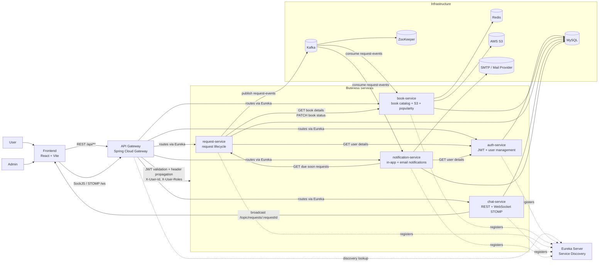
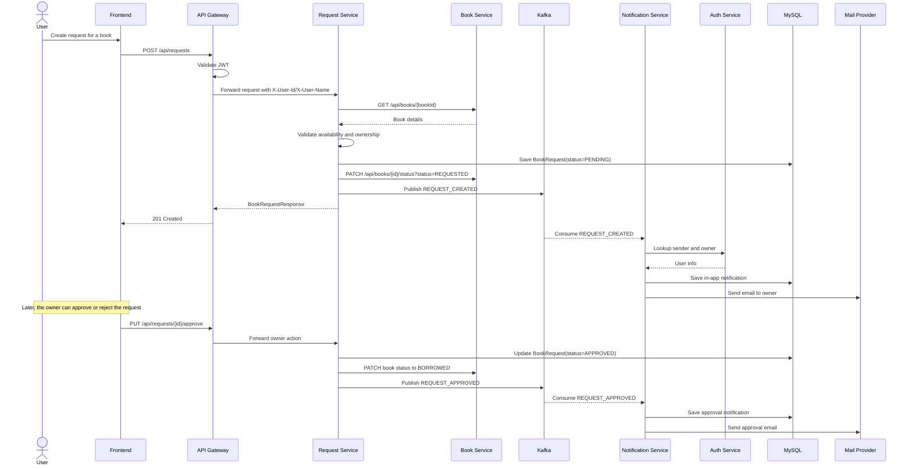
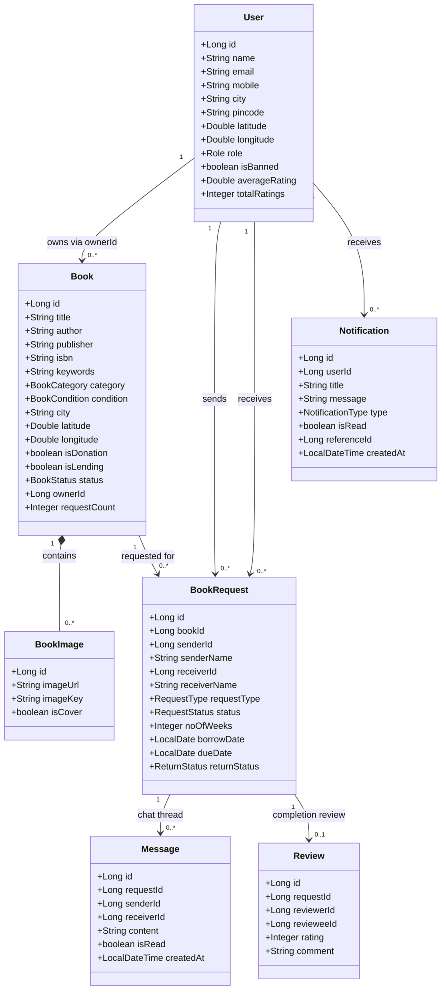

# ReBook Architecture And UML

This document is based on the current codebase, Docker orchestration, and service implementations in this repository.

Scope used for these diagrams:
- Included: frontend, api-gateway, eureka-server, auth-service, book-service, request-service, chat-service, notification-service, MySQL, Redis, Kafka, ZooKeeper, AWS S3, and mail delivery.
- Excluded from the main architecture: rag-service, because it exists as a scaffold and is not wired into the active runtime flow.

## 1. System Architecture Diagram



## 2. UML Sequence Diagram

This sequence shows the main borrow/request workflow and the async notification path.



## 3. UML Domain Class Diagram

This class diagram shows the logical domain model. Some relationships are cross-service references by ID rather than direct JPA associations, which is normal in this microservices design.



## 4. Mermaid Source Files

The same diagrams are also available as standalone Mermaid files:
- `docs/diagrams/rebook-architecture.mmd`
- `docs/diagrams/rebook-request-sequence.mmd`
- `docs/diagrams/rebook-domain-class.mmd`

## 5. Commands To Generate Images

Install Mermaid CLI once:

```bash
npm install -g @mermaid-js/mermaid-cli
```

Generate PNG files:

```bash
mmdc -i docs/diagrams/rebook-architecture.mmd -o docs/diagrams/rebook-architecture.png -b white
mmdc -i docs/diagrams/rebook-request-sequence.mmd -o docs/diagrams/rebook-request-sequence.png -b white
mmdc -i docs/diagrams/rebook-domain-class.mmd -o docs/diagrams/rebook-domain-class.png -b white
```

Generate SVG files:

```bash
mmdc -i docs/diagrams/rebook-architecture.mmd -o docs/diagrams/rebook-architecture.svg -b white
mmdc -i docs/diagrams/rebook-request-sequence.mmd -o docs/diagrams/rebook-request-sequence.svg -b white
mmdc -i docs/diagrams/rebook-domain-class.mmd -o docs/diagrams/rebook-domain-class.svg -b white
```